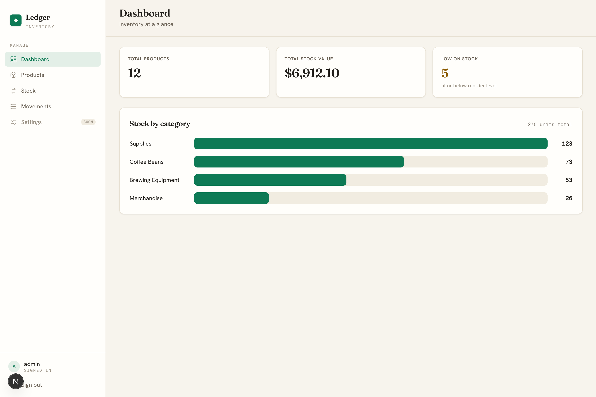
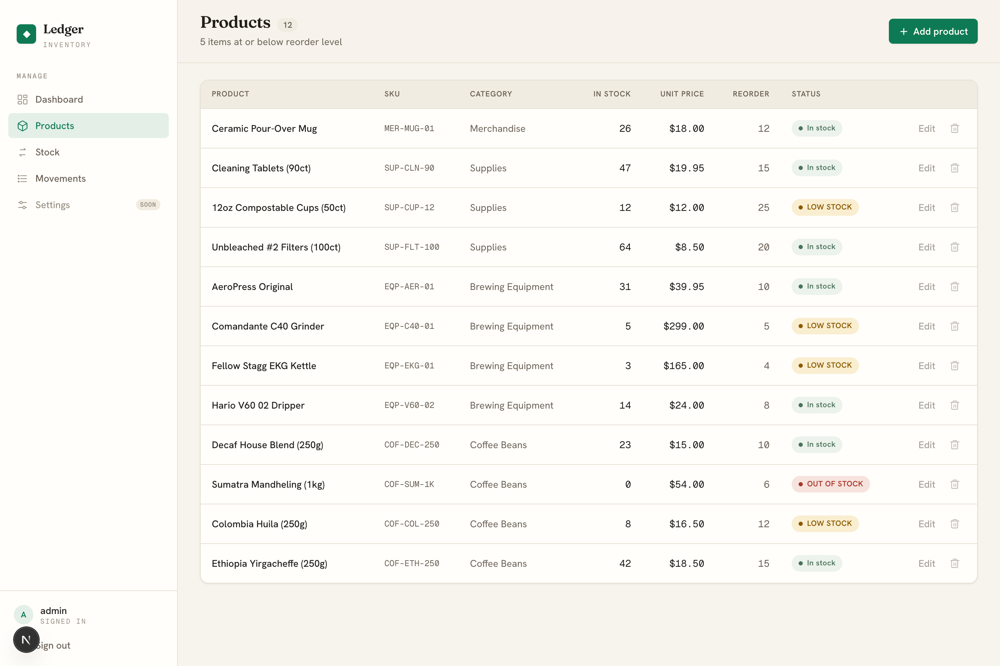
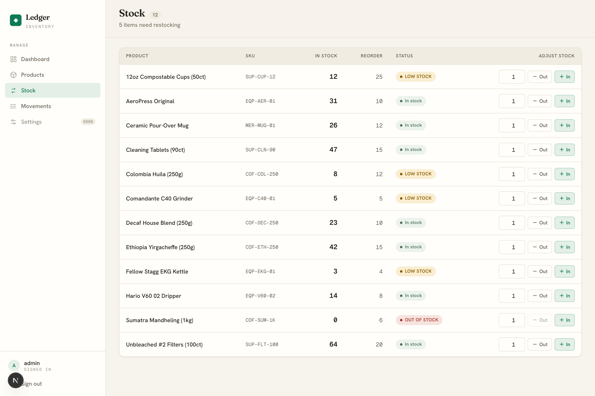
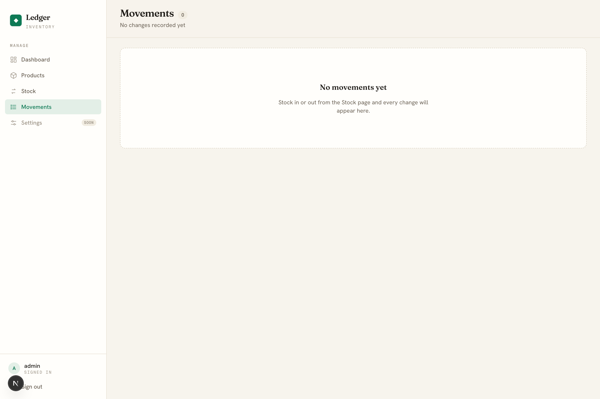
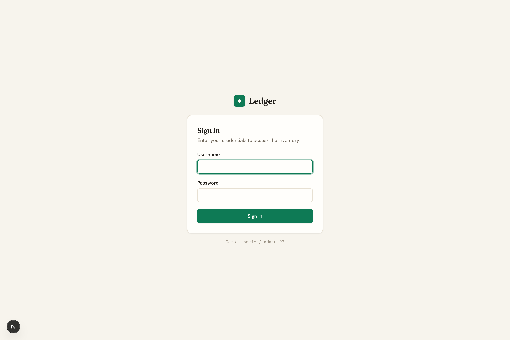

# Inventory Management System — Built with Claude Code

A complete inventory management system built end to end with **Claude Code** on the [AyyazTech](https://www.youtube.com/@AyyazTech) YouTube channel. Products, a Stock page for stock in/out, a Movements audit log, live low-stock alerts, a dashboard, and login.

🎥 **Watch the full build:** https://youtu.be/eOFUR48DCQg
🔔 **Subscribe for more:** https://www.youtube.com/@AyyazTech
🌐 **More tutorials:** https://ayyaztech.com

## Features

- 🔐 **Login** — simple username + password auth (hashed passwords, server sessions)
- 📦 **Products** — name, SKU, category, quantity, unit price, reorder level
- 🔁 **Stock in / out** — adjust quantities from the Stock page
- 🧾 **Movements** — an immutable audit log of every stock change
- 🚨 **Low-stock alerts** — automatic badges when quantity drops to or below the reorder level
- 📊 **Dashboard** — total products, total stock value, low-stock count, and a stock-by-category chart

## Screenshots

**Dashboard**


**Products**


**Stock**


**Movements**


**Login**


## Tech stack

Next.js 16 (App Router) · Prisma 6 + SQLite · Tailwind CSS 4 · Zod · TypeScript

## Getting started

Requires Node 20+ and [bun](https://bun.sh).

```bash
# 1. Install dependencies
bun install

# 2. Create your environment file and set an auth secret
cp .env.example .env
# generate a secret and paste it into .env as AUTH_SECRET:
openssl rand -base64 32

# 3. Set up the database (applies migrations, generates the client, creates dev.db)
bunx prisma migrate dev

# 4. Seed the demo data (sample products, stock movements, and the demo login)
bun run db:seed

# 5. Run it
bun dev
```

Open http://localhost:3000

### Demo login

```
Username: admin
Password: admin123
```

## How it was built

Built in stages by prompting Claude Code — the products foundation first, then the Stock + Movements pages, the dashboard, and finally login. The UI direction was guided by Claude Code's official frontend-design skill. Watch the full build on the channel above.

## License

MIT — use it, learn from it, build on it.
